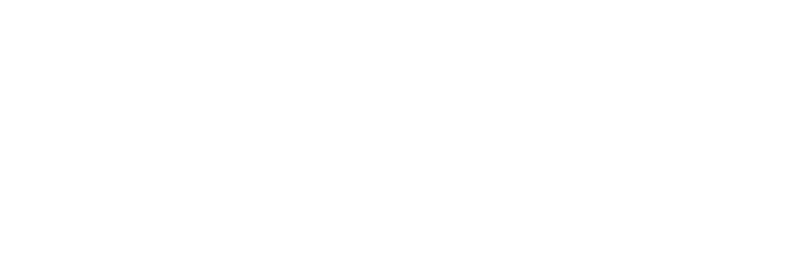

  

  # Hamza Paracha

  Software engineer focused on systems, security, and applied AI.

  I am University Lead for Zed Industries, and Warden has crossed 1,000+ downloads on npm.

  [Resume](https://github.com/DevDonzo/personal-site/raw/main/public/HamzaPResume.pdf) •
  [Portfolio PDF](https://github.com/DevDonzo/personal-site/raw/main/Hamza_Paracha_Portfolio_FuturePath2026.pdf) •
  [GitHub](https://github.com/DevDonzo) •
  [LinkedIn](https://www.linkedin.com/in/hamza-paracha-03a091266/)

---

## About

I build developer tooling, security automation, and AI systems that are useful in practice, not just interesting in demos. My work sits at the intersection of software engineering, agentic workflows, cloud infrastructure, and technical community building.

I care most about tools that reduce friction for builders, keep humans in the loop when it matters, and make systems dependable enough to trust.

## Current Work

- **University Lead, Zed Industries** - leading campus engagement, workshops, and technical conversations around modern developer tooling
- **Co-Captain, AWS Cloud Club** - supporting community programming and cloud-focused learning
- **AI System Engineer Intern, Innovance.ai** - working on AI systems and applied infrastructure

## Selected Projects

- **[Warden](https://github.com/DevDonzo/warden)** - autonomous security agent CLI for scanning, diagnosis, fix preparation, and reviewable change generation
- **[CodeSensei](https://github.com/DevDonzo/Mac-a-thon-2026)** - VS Code extension and AI reasoning engine
- **[DigitalFTE](https://github.com/DevDonzo/DigitalFTE)** - terminal-first AI assistant workflow
- **[Google Agentverse](https://github.com/DevDonzo/agentverse-dataengineer)** - GCP data pipeline and agent orchestration

## Experience Snapshot

- **AI System Engineer Intern, Innovance.ai** - Apr 2026 to Present
- **University Lead, Zed Industries** - Mar 2026 to Present
- **Co-Captain, AWS Cloud Club** - Feb 2026 to Present
- **Penetration Tester Intern, Sekurity Partners** - Apr 2025 to Aug 2025

## Certifications

- Claude with Amazon Bedrock
- Microsoft Fabric Data Engineer Associate (DP-700)
- AWS Certified Machine Learning Engineer - Associate
- AWS Certified Cloud Practitioner
- PCAP - Certified Associate Python Programmer

## Resume

If you want the longer version, start here:

- [Full resume PDF](https://github.com/DevDonzo/personal-site/raw/main/public/HamzaPResume.pdf)
- [Portfolio PDF](https://github.com/DevDonzo/personal-site/raw/main/Hamza_Paracha_Portfolio_FuturePath2026.pdf)

## Contact

- [Email](mailto:hparacha@uoguelph.ca)
- [LinkedIn](https://www.linkedin.com/in/hamza-paracha-03a091266/)
- [Zed](https://zed.dev)
